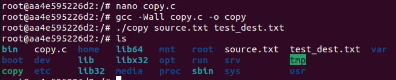

### Встановлення Docker
```
sudo apt update
sudo apt install -y docker.io
sudo systemctl enable docker
sudo systemctl start docker
sudo usermod -aG docker masha
sudo reboot -h now
```


Створюємо [Dockerfile](Dockerfile)


## Завдання 1 


Для запуску контейнера з-під рута, додаємо параметр --privileged

```docker run --rm -it --privileged ssa_pr3```

## Завдання 2


[infinity.c](infinity.c)

```gcc -Wall infinity.c -o inf```


## Завдання 3
```ulimit -f 1  # ліміт 1 блок = 512 байт```

```gcc -Wall dice.c -o dice```


Вміст dice.log


## Завдання 4
```ulimit -t 1 # max CPU time```

```gcc -Wall lotery.c -o lotery```


## Завдання 5

```echo "Test" > source.txt```


```gcc -Wall -o copy copy.c```

```./copy source.txt test_dest.txt```



## Завдання 6
```ulimit -s 64 # stack size```

```gcc -Wall -o stack stack.c```

Результат без лімітів


Результат з лімітом


## Завдання 7
```ulimit -u 10 ```

```gcc -Wall process.c -o pr```


